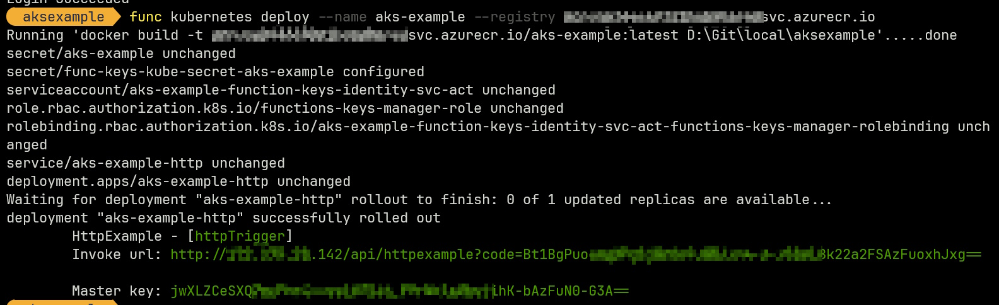

# Azure Functions in AKS

## Overview

It is possible to create, deploy and run Azure Function that run in AKS with KEDA, instead of an App Service Plan.

## Sample

### Create a function

```powershell
cd src/
func init AksFunctionApp --worker-runtime dotnet --docker
cd AksFunctionApp/
```

### "Http trigger" example

```powershell
func new --name HttpExample --template "HTTP trigger"
dotnet build
# Set the kubectl context to the target AKS cluster + namespace
$ACR = "acrtouse"
az acr login -n $ACR
func kubernetes deploy --name aks-func-app --registry "$ACR.azurecr.io"
```

Result:



The Kubernetes objects created are:

- 2 `secret`s
- 1 `serviceaccount`
- 1 `role`
- 1 `rolebinding`
- 1 `service`
- 1 `deployment`

Basic test:

[http://172.175.20.142/api/httpexample?name=test&code=Bt1BgPuoem********FuoxhJxg==](http://172.175.20.142/api/httpexample?name=test&code=<API key>)

### "Azure Service Bus Queue trigger" example

To see if we can run an Azure Function triggered by an Azure Service Bus Queue message, we:

1 - delete the Http trigger function (ensure we are clean focusing on the new trigger)

```powershell
func new --name AsbqExample --template "ServiceBusQueueTrigger"
```

## References
