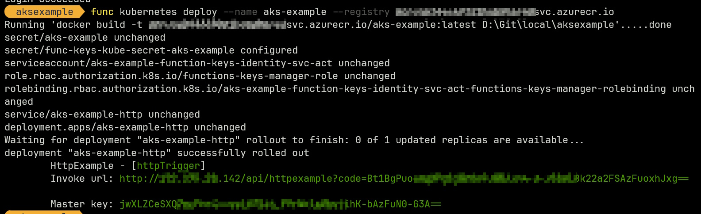
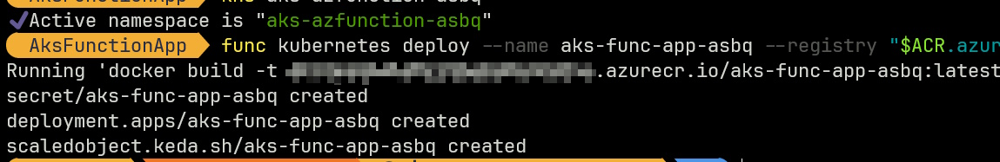
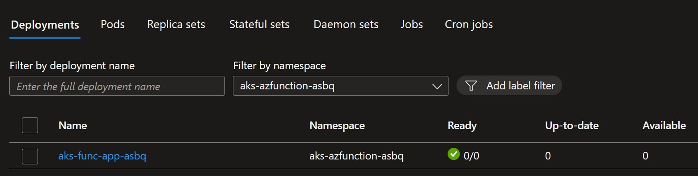
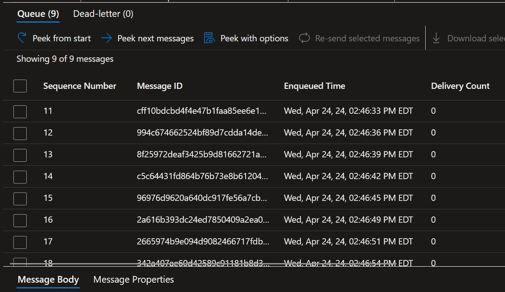
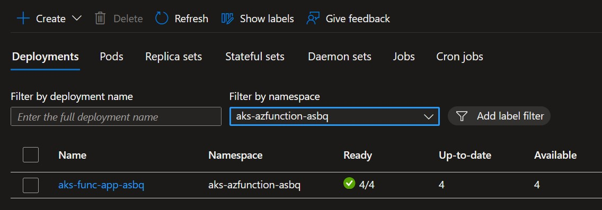

# Azure Functions in AKS

## Overview

It is possible to create, deploy and run Azure Function that run in AKS with KEDA, instead of an App Service Plan.

## Sample

### Create a function

```powershell
cd src/
func init AksFunctionApp --worker-runtime dotnet --docker
cd AksFunctionApp/
```

### "Http trigger" example

```powershell
func new --name HttpExample --template "HTTP trigger"
dotnet build
# Set the kubectl context to the target AKS cluster + namespace
$ACR = "acrtouse"
az acr login -n $ACR
func kubernetes deploy --name aks-func-app --registry "$ACR.azurecr.io"
```

Result:



The Kubernetes objects created are:

- 2 `secret`s
- 1 `serviceaccount`
- 1 `role`
- 1 `rolebinding`
- 1 `service`
- 1 `deployment`

Basic test:

[http://172.175.20.142/api/httpexample?name=test&code=Bt1B********FuoxhJxg==](http://172.175.20.142/api/httpexample?name=test&code=<API key>)

### "Azure Service Bus Queue trigger" example

#### Create and Test locally

To see if we can run an Azure Function triggered by an Azure Service Bus Queue message, we:

1. Comment the entire content of the Http trigger function file

It ensures we are only focusing on the new function & trigger.

2. Create a `ServiceBusQueueTrigger` Function

    ```powershell
    func new --name AsbqExample --template "ServiceBusQueueTrigger"
    ```

3. Decide and Set a Connection String **Key** in the Function code + adapt the code

    ```csharp
    public void Run(
      [ServiceBusTrigger(QueueName, Connection = "SbNamespaceCS")]
      ServiceBusReceivedMessage message,
      ILogger log
    )
    {
      log.LogInformation($"C# ServiceBus queue trigger invoked on queue: {QueueName}");
      log.LogInformation($"   MessageId:    {message.MessageId}");
      log.LogInformation($"   Body/Content: {message.Body}");
    }
    ```

4. Create the chosen Connection String **Key** in the file `local.settings.json`, creating a block `"ConnectionStrings:"`

    ```json
    {
      "IsEncrypted": false,
      "Values": {
        "AzureWebJobsStorage": "UseDevelopmentStorage=true",
        "FUNCTIONS_WORKER_RUNTIME": "dotnet"
      },
      "ConnectionStrings": {
        "SbNamespaceCS": "Endpoint=sb://****************"
      }
    }
    ```

   > Important: The Connection String value must give access to the Service Bus Namespace, not the queue!

5. Set the Queue Name in the Function code

    I used this approach for the sample, but there many other ways:

    ```csharp
    private const string QueueName = "<queue name>";
    ```

6. Run/Debug locally

#### Adapt and deploy to AKS

1. Create an entry for the Connection String **Key** in **the `"Values"` section** of `local.settings.json`

    ```json
    {
      "IsEncrypted": false,
      "Values": {
        "AzureWebJobsStorage": "UseDevelopmentStorage=true",
        "FUNCTIONS_WORKER_RUNTIME": "dotnet",
        "SbNamespaceCS": "Endpoint=sb://****************"
      },
      "ConnectionStrings": {
        "SbNamespaceCS": "Endpoint=sb://****************"
      }
    }
    ```

   The `func kubernetes deploy` uses this convention to use the `Values` JSON node to create a Kubernetes Secret with the Key / Value pairs in teh node, exposed in the pod.

2. Create a new `namespace` (for clean separation) and make it default

3. Deploy the function

    ```powershell
    func kubernetes deploy --name aks-func-app-asbq --registry "$ACR.azurecr.io"
    ```

    

    > Note: The `func kubernetes deploy` uses the current KubeConfig context in the session to deploy to the AKS cluster + namespace.
    > If you need to change the context, use `kubectl config use-context <context name>`.
    > For more information, see [func kubernetes deploy](https://learn.microsoft.com/en-us/azure/azure-functions/functions-core-tools-reference?tabs=v2#func-kubernetes-deploy).

4. Check the Deployment runs

    

    > Note: The deployment has no pods running because there are no messages in the queue.

5. Test it works

    1. Create messages in the queue
    
    2. See the `KEDA` scaling the deployment creating replica(s)
    
    3. See the pod(s) logs to check they got the message(s)
    
    4. After the messages are processed, the pod(s) are scaled down (back to 0 here)

### What's next

If there's a direct link between a Message in the Queue and a Function, using `KEDA` to scale the deployment based on the number of messages in the queue is very efficient.

## References

[Azure Functions on Kubernetes with KEDA](https://learn.microsoft.com/en-us/azure/azure-functions/functions-kubernetes-keda)

[func kubernetes deploy](https://learn.microsoft.com/en-us/azure/azure-functions/functions-core-tools-reference?tabs=v2#func-kubernetes-deploy)
